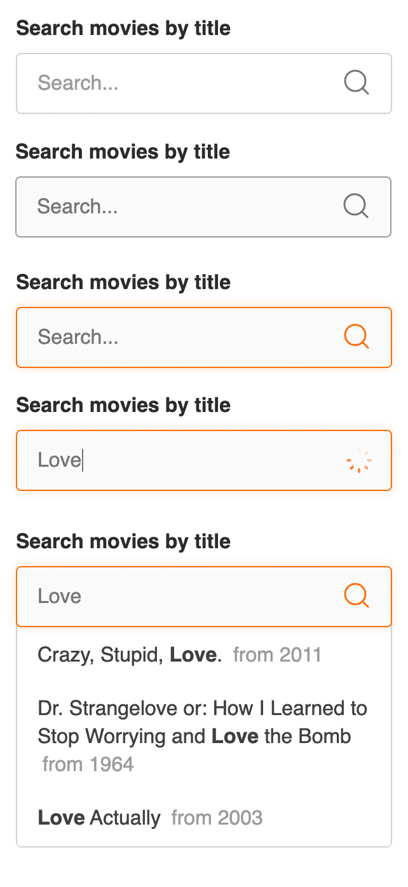

# Live Input Search

## Component previews

## How does the filter work?
I use the [OMDb API](http://www.omdbapi.com/) which is an open movie database.
The input will search for a match in the movie name of the API Search results.

## Search examples:
- Wars
- Love
- Vampire
- Bat

## To do

## Available Scripts

In the project directory, you can run:

### `npm start`

Runs the app in the development mode.\
Open [http://localhost:3000](http://localhost:3000) to view it in the browser.

This project was bootstrapped with [Create React App](https://github.com/facebook/create-react-app).

